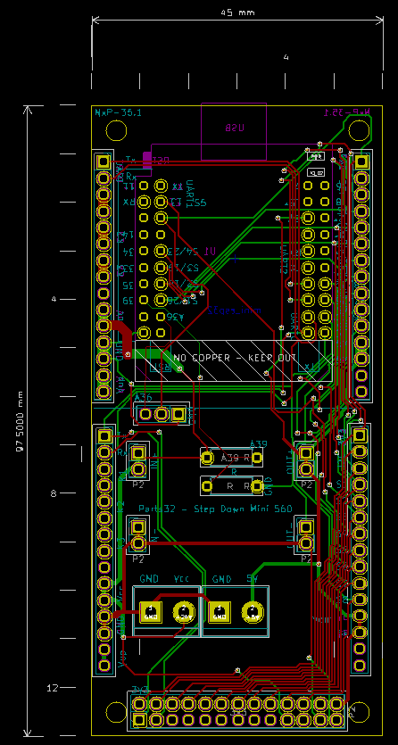

# NxP-35  2xP15 WemosESP32

This repository contains the KiCad PCB design files for a custom ESP32 Wemos32 module carrier board.

Key Features:

 - ESP32 Wemos32 socket for direct module integration
 - Two P15 board-to-board connectors for peripheral expansion and signal routing
 - Onboard step-down converter (5V regulator) for stable supply from higher input voltages
 - Voltage sensing circuit on GPIO39 (IO39) enabling ADC-based supply monitoring
 - Compact PCB layout optimized for modular integration into larger systems

This hardware is intended as a foundation for embedded applications requiring regulated 5V input, expandable connectivity, and real-time power supervision.

---
## See also

 - [nweb:doc](https://pi.bsnx.net/4.0/w/group/118AFDA59CAAB3FA49CA190666FCF396/d/43205) (Restricted Access)
